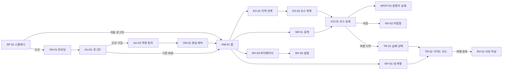
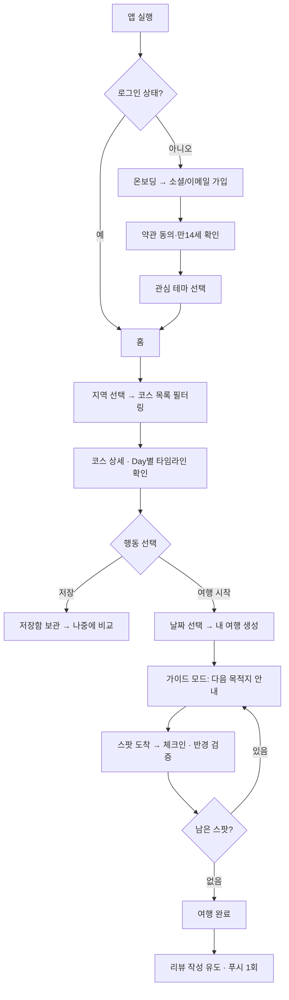
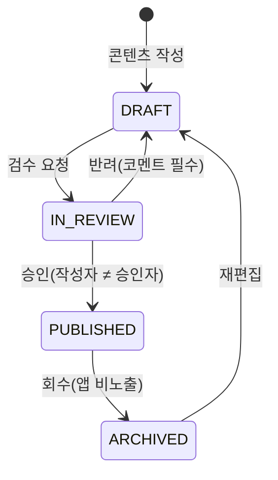
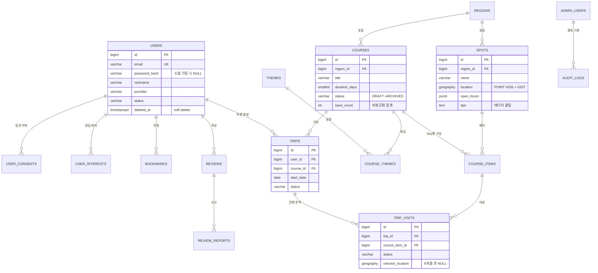
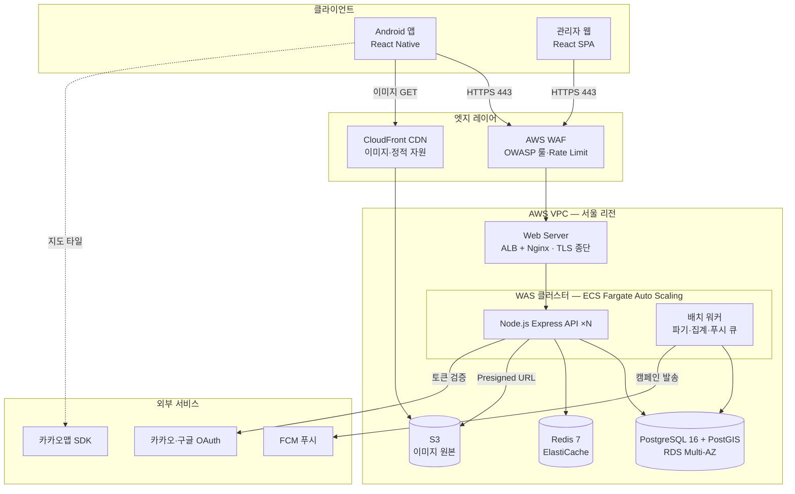
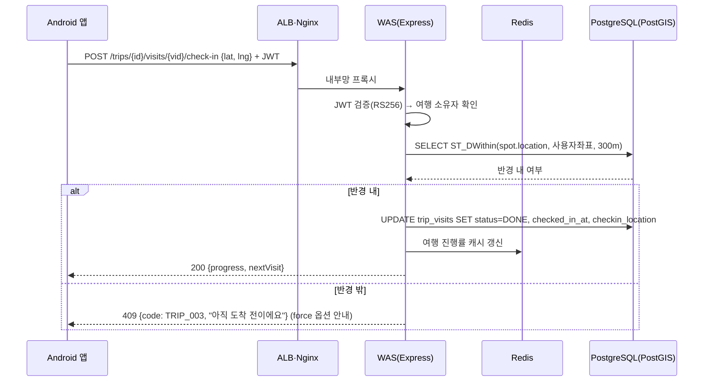

# TravelPack 서비스 기획·설계서

| 항목 | 내용 |
|---|---|
| 문서 버전 | v1.2 (v1.0 2026-06-12 최초 작성 → v1.1 2026-06-13 와이어프레임 추가 → v1.2 2026-06-13 오픈 이슈 4건 결정 반영) |
| 작성일 | 2026-06-12 |
| 와이어프레임 | [`design/wireframes.html`](../design/wireframes.html) — 전체 20개 화면, 브라우저로 열람 |
| 작성 관점 | 시니어 서비스 기획자 · 시스템 아키텍트 |
| 대상 독자 | 디자인(Figma) · 안드로이드 · 백엔드 · 인프라 · 보안/법무 담당 |
| 범위 | MVP(안드로이드 우선 출시) + 관리자 웹(CMS) |

---

## 0. 프로젝트 개요

### 0.1 서비스 정의

> **TravelPack** — "패키지여행의 편안함을 앱으로."
> 이것저것 알아보기 귀찮은 사람을 위해, 대표 명소 위주의 **검증된 여행 코스**를 추천하고
> 코스를 따라가며 쓰는 **가이드 모드**와 관광지 **큐레이션 정보**를 제공하는 모바일 앱.

핵심 가설: **"여행 준비 시간을 3시간에서 3분으로 줄인다."**

| 구분 | 내용 |
|---|---|
| 타깃 사용자 | 여행 계획 세우기를 귀찮아하는 20~40대 자유여행객. 검색·비교 대신 "정해진 코스"를 원함 |
| 핵심 가치 1 | **코스 추천** — 지역·기간·테마만 고르면 1박2일/2박3일 단위의 완성된 코스 제공 |
| 핵심 가치 2 | **가이드 모드** — 여행 중 현재 위치 기반으로 다음 목적지 안내, 스팟 도착 시 체크인 |
| 핵심 가치 3 | **큐레이션** — 관광지별 핵심 정보(운영시간·입장료·평균 체류시간) + 에디터 꿀팁 |
| 수익 모델(차기) | 제휴 입장권/맛집 예약 수수료, 프리미엄 코스, 광고 배너 |

**MVP 포함 범위**: 소셜 로그인, 지역/테마별 코스 탐색, 코스·관광지 큐레이션, 저장(북마크), 내 여행(가이드 모드·체크인), 리뷰, 관리자 CMS

**MVP 제외(차기 버전)**: 결제/예약, AI 맞춤 코스 생성, 오프라인 지도, 다국어, iOS

### 0.2 확정 기술 스택

| 레이어 | 선택 | 선정 사유 |
|---|---|---|
| 모바일 앱 | **React Native 0.7x + TypeScript** | 안드로이드 우선 출시 후 iOS 확장 시 코드 재사용. 지도·푸시 네이티브 모듈 생태계 검증됨 |
| 관리자 웹 | React 18 + Vite + TypeScript | CMS는 웹이 생산성 우위. 앱과 디자인 토큰 공유 |
| Backend(WAS) | **Node.js 22 LTS + Express + TypeScript** | 프론트와 언어 통일로 풀스택 효율. I/O 중심 워크로드에 적합 |
| ORM | Prisma | Parameterized Query가 기본 — SQL 인젝션 원천 차단, 스키마 마이그레이션 관리 |
| DB | **PostgreSQL 16 + PostGIS** | 좌표 기반 질의(주변 스팟, 체크인 반경 검증)에 PostGIS 필수 |
| 캐시/세션 | Redis 7 | Refresh Token 저장(RTR), 인기 코스 캐시, Rate Limit 카운터 |
| 스토리지/CDN | AWS S3 + CloudFront | 이미지 원본/리사이즈본 분리, 전국 단위 CDN 캐시 |
| 인증 | **JWT(RS256) Access 30분 / Refresh 14일 + Rotation, bcrypt(cost 12)** | 모바일 앱 표준. 비대칭키로 검증 서버 분리 가능 |
| 소셜 로그인 | 카카오 · 구글 OAuth 2.0 | 국내 시장 카카오 필수, 구글은 플레이스토어 기본 |
| 지도 | **Kakao Maps SDK (확정)** | 국내 POI 품질 + 무료 쿼터 일 30만 건(초과 0.1원/건). 네이버는 2025-07부로 지도 API 무료 이용량 종료되어 비용 열위. RN 래퍼 `@react-native-kakao/map` 활용 (6.2절 결정 2) |
| 관광 데이터 | **한국관광공사 TourAPI 4.0 (확정)** | 공공데이터포털 국문 관광정보 서비스(KorService2). 관광지·여행코스(contentTypeId 25) 약 26만 건, 상업적 이용 가능·출처 표시 (6.2절 결정 1) |
| 푸시 | FCM | 안드로이드 표준 |
| 인프라 | AWS 서울 리전 (ALB + ECS Fargate, RDS Multi-AZ, ElastiCache, WAF) | 오토스케일링, 관리형 운영 부담 최소화 |

---

## 1. 화면 설계 — Figma 작업 가이드

> 디자이너는 본 섹션을 그대로 Figma로 옮기면 된다. 기준 해상도 **360 × 800dp**(갤럭시 표준),
> 최소 터치 영역 **48dp**, 4pt 그리드.
> 1.2절 화면 목록 전체(20개)의 레이아웃 시안은 [`design/wireframes.html`](../design/wireframes.html)에서 확인.

### 1.1 디자인 토큰

| 토큰 | 값 | 용도 |
|---|---|---|
| `color/primary` | `#FF6B35` (선셋 오렌지) | CTA 버튼, 활성 탭, 체크인 강조 |
| `color/secondary` | `#1D3557` (딥 네이비) | 헤더, 타이틀 텍스트 |
| `color/bg` | `#FFFFFF` / `#F7F7F9` | 기본 배경 / 섹션 구분 배경 |
| `color/text` | `#191F28` / `#6B7684` / `#8B95A1` | 본문 / 보조 / 힌트 |
| `color/success` `error` | `#12B76A` / `#F04438` | 체크인 완료 / 오류·삭제 |
| `font` | Pretendard | H1 24/SemiBold · H2 20/SemiBold · Title 17/Medium · Body 15/Regular · Caption 12/Regular |
| `radius` | 카드 16 · 버튼 12 · 칩 999(pill) | |
| `spacing` | 4 / 8 / 12 / 16 / 24 (4pt 그리드) | 화면 좌우 기본 마진 20 |
| `elevation` | 카드 그림자 y2 blur8 8% | 바텀시트 y-4 blur16 12% |

> **브랜드 로고** — 콘셉트 "게임팩 × 소풍"(카트리지 + 라벨 창 속 여행 핀). 메인은 선셋 오렌지, 보조 네이비, 시즌 그린·바다.
> 원본 SVG·앱 아이콘·워드마크는 [`design/logo/`](../design/logo/), 브랜드 시트는 [`design/logo.html`](../design/logo.html) 참조. 컬러 토큰은 위 표와 동일 체계.

### 1.2 화면 목록 (Screen Inventory)

| ID | 화면명 | 핵심 요소 | 진입 경로 |
|---|---|---|---|
| SP-01 | 스플래시 | 로고, 자동 로그인 판정 | 앱 실행 |
| ON-01 | 온보딩(3스텝) | 서비스 가치 소개 슬라이드 | 최초 실행 |
| AU-01 | 로그인 | 카카오/구글 버튼, 이메일 로그인, 둘러보기 | 온보딩 후 |
| AU-02 | 약관 동의 | 필수/선택 약관 체크(전체동의), 만 14세 이상 확인 | 신규 가입 시 |
| AU-03 | 이메일 가입 | 이메일·비밀번호·닉네임 입력 | AU-01 |
| ON-02 | 관심 테마 선택 | 테마 칩 다중 선택(힐링·미식·역사·인생샷 등) | 가입 직후 |
| HM-01 | 홈 | 검색바, 배너, 추천 코스 캐러셀, 인기 지역, 테마 큐레이션 | 메인 탭 1 |
| EX-01 | 지역 선택 | 지역 그리드(제주·부산·경주·여수…) | 홈 → 탐색 탭 2 |
| EX-02 | 코스 목록 | 필터 칩(기간·테마·동행), 코스 카드 리스트 | EX-01 |
| CO-01 | 코스 상세 | 커버, 코스 요약(기간·스팟 수·예상 경비), Day별 타임라인, 지도 미리보기, 리뷰 요약, CTA 2개(저장/여행 시작) | EX-02, 홈 |
| CO-02 | 코스 전체 지도 | 경로 폴리라인 + 번호 마커 | CO-01 |
| SPOT-01 | 관광지 상세 | 사진 갤러리, 핵심 정보 표, 에디터 꿀팁 박스, 주변 스팟 | CO-01 타임라인 |
| TR-01 | 여행 시작(날짜 선택) | 캘린더, 시작일 선택 → 내 여행 생성 | CO-01 CTA |
| TR-02 | **가이드 모드** | 상단 지도(경로·현재 위치), 하단 시트(다음 목적지 카드, 체크인 버튼, 진행도) | MY-01, TR-01 |
| SR-01 | 통합 검색 | 최근 검색어, 자동완성, 결과 탭(코스/관광지/지역) | 홈 검색바 |
| MY-01 | 내 여행 | 예정/진행 중/완료 탭, 여행 카드 | 메인 탭 3 |
| MY-02 | 저장함 | 코스/스팟 북마크 목록 | 메인 탭 4 |
| MY-03 | 마이페이지 | 프로필, 내 리뷰, 설정 진입 | 메인 탭 5 |
| MY-04 | 설정 | 알림 설정, 위치 권한, 개인정보 동의 관리, 로그아웃, 회원탈퇴 | MY-03 |
| RV-01 | 리뷰 작성 | 별점, 텍스트(최대 1,000자), 사진 첨부(최대 5장) | 여행 완료, SPOT-01 |

하단 탭 5개: **홈 · 탐색 · 내 여행 · 저장 · MY**

### 1.3 화면 흐름도



### 1.4 핵심 화면 상세 스펙

#### HM-01 홈
- **목적**: 탐색 진입점. "고민 없이 3분 안에 코스 선택" 경험의 시작.
- **구성(상→하)**: ① 상단 앱바 — 로고 + 알림 아이콘 ② 검색바(고정) ③ 배너 캐러셀(마케팅 편성, 비율 2:1) ④ "이번 주 추천 코스" 가로 캐러셀 — 카드(커버 이미지, 제목, `1박2일 · 명소 8곳 · 약 12만원`, 저장 수) ⑤ "어디로 떠날까요" 지역 그리드 2×4 ⑥ 관심 테마 기반 큐레이션 섹션(온보딩 선택 반영) ⑦ 하단 탭
- **인터랙션**: 코스 카드 탭 → CO-01. 당겨서 새로고침.
- **엣지**: 비로그인(둘러보기) 시 저장 탭 시 로그인 바텀시트. 네트워크 오류 시 재시도 화면.

#### EX-02 코스 목록
- **구성**: ① 앱바(지역명 + 변경 버튼) ② 필터 칩 가로 스크롤 — `기간(당일/1박2일/2박3일)` `테마` `동행(혼자/커플/가족)` ③ 정렬(추천순/저장순/최신순) ④ 코스 카드 세로 리스트(이미지 16:9, 제목, 메타, 테마 태그, 저장 버튼)
- **엣지**: 필터 결과 0건 → 빈 상태 일러스트 + "필터 초기화" 버튼.

#### CO-01 코스 상세 (서비스의 핵심 화면)
- **구성**: ① 커버 이미지(스와이프 갤러리) + 뒤로가기/공유/저장 오버레이 ② 타이틀 영역 — 코스명, 요약 한 줄, 메타 배지(`2일`, `명소 8곳`, `예상 경비 12만원`, `도보+대중교통`) ③ **Day 탭(Day 1 / Day 2)** ④ **타임라인** — 세로 스텝퍼: 각 스팟 카드(순번, 썸네일, 이름, 체류 시간, 한 줄 큐레이션) + 스팟 사이 이동 정보(`도보 15분` / `버스 30분`) ⑤ 지도 미리보기(전체 경로) → 탭 시 CO-02 ⑥ 리뷰 요약(평점 + 최신 2개) ⑦ 하단 고정 CTA 바 — `저장` (아이콘) + `이 코스로 여행 시작` (Primary, full-width)
- **인터랙션**: 스팟 카드 탭 → SPOT-01. CTA → TR-01(날짜 선택 바텀시트).

#### SPOT-01 관광지 상세
- **구성**: ① 사진 갤러리 ② 이름/카테고리/평점 ③ **핵심 정보 표** — 운영시간(오늘 기준 영업 중 여부 강조), 입장료, 평균 체류 시간, 주소(복사·길찾기 버튼), 전화 ④ **에디터 꿀팁 박스**(Primary 연한 배경) — "오후 4시 이후 방문하면 줄이 짧아요" ⑤ 상세 소개 ⑥ 리뷰 ⑦ 주변 추천 스팟
- **엣지**: 휴무일이면 운영시간 행에 `오늘 휴무` 빨간 배지.

#### TR-02 가이드 모드 (차별화 핵심)
- **구성**: ① 상단 60% 지도 — 코스 경로, 번호 마커(완료=회색 체크, 다음=Primary 펄스), 현재 위치 ② 하단 40% 바텀시트(드래그 확장) — 진행도 바(`3/8 완료 · Day 1`), **다음 목적지 카드**(이름, 남은 거리, 도보 시간, 길찾기 버튼), `도착했어요(체크인)` Primary 버튼, `건너뛰기` 텍스트 버튼 ③ 시트 확장 시 전체 타임라인
- **인터랙션**: 체크인 → 위치 반경(300m) 검증 → 성공 애니메이션 + 다음 목적지 자동 전환. 반경 밖이면 "아직 도착 전이에요" 토스트 + `그래도 체크인` 옵션. 마지막 스팟 체크인 → 여행 완료 화면 → 리뷰 유도.
- **엣지**: 위치 권한 거부 시 — 지도 비활성 + 수동 체크인 모드로 폴백(권한 재요청 배너). GPS 음영 지역 토스트.

#### MY-01 내 여행
- **구성**: 세그먼트 탭(예정/진행 중/완료) + 여행 카드(코스명, 날짜, D-day 또는 진행도, 진행 중이면 `가이드 모드 이어하기` 버튼)
- **엣지**: 빈 상태 → "아직 여행이 없어요" + 추천 코스 바로가기.

#### AU-02 약관 동의 (법무 요건 반영)
- **구성**: ① 전체 동의 체크 ② 개별 항목 — `[필수] 서비스 이용약관` `[필수] 개인정보 수집·이용 동의` `[필수] 만 14세 이상입니다` `[선택] 위치기반서비스 이용약관` `[선택] 마케팅 정보 수신(푸시)` ③ 각 항목 우측 `보기` → 전문 웹뷰 ④ 하단 `동의하고 시작하기`(필수 체크 전 비활성)
- **정책**: 위치 약관은 선택 — 미동의 시 가이드 모드 진입 시점에 재요청. 동의 이력은 항목·버전·시각 서버 저장.

#### MY-04 설정
- **구성**: 알림(마케팅 푸시 토글 — 변경 시 일시 표기 토스트, 야간 수신 별도 토글), 위치 정보 동의 관리, 개인정보 처리방침/약관 링크, 캐시 삭제, 로그아웃, **회원탈퇴**(2단계 확인 — 사유 선택 + 데이터 삭제 안내)

### 1.5 Figma 파일 구조 제안

```
📄 TravelPack_Android
 ├─ 00_Cover            — 프로젝트 개요, 버전 히스토리
 ├─ 01_Foundations      — 컬러/타이포/그리드/아이콘 (토큰 = 1.1 표)
 ├─ 02_Components       — Button(Primary·Ghost·Disabled variants), Card/Course, Card/Spot,
 │                        Chip/Filter, ListItem/Timeline, BottomTab, AppBar, BottomSheet,
 │                        Dialog, Toast, EmptyState, Badge
 ├─ 03_Flow_Onboarding  — SP·ON·AU 화면 + 프로토타입 연결
 ├─ 04_Flow_Explore     — HM·EX·CO·SPOT·SR
 ├─ 05_Flow_Trip        — TR·MY·RV
 ├─ 06_Admin_Web        — 관리자 화면(데스크톱 1440)
 └─ 99_Archive
```
- 모든 프레임은 Auto Layout, 텍스트는 토큰 스타일 연결, 컴포넌트는 variants로 상태(default/pressed/disabled) 정의.
- 개발 핸드오프: Dev Mode 기준, 코스 카드·타임라인 아이템은 컴포넌트 단위로 안드로이드 컴포넌트와 1:1 매핑.

---

## 2. [1단계] 종합 서비스 기획안

### 2.1 일반 사용자 흐름 (핵심 User Flow)



| 단계 | 화면 | 사용자 행동 | 시스템 동작 |
|---|---|---|---|
| 1. 진입 | SP-01 | 앱 실행 | Refresh Token 유효성 검사 → 자동 로그인/온보딩 분기 |
| 2. 가입 | AU-01~02 | 카카오 1탭 가입, 약관 동의 | 소셜 토큰 검증, 동의 이력(버전 포함) 저장, JWT 발급 |
| 3. 개인화 | ON-02 | 관심 테마 3개 선택 | `user_interests` 저장 → 홈 큐레이션 가중치 반영 |
| 4. 탐색 | HM/EX | 지역·기간·테마 필터 | 캐시된 발행 코스 목록 반환(Redis 5분 TTL) |
| 5. 결정 | CO-01 | 타임라인·경비·리뷰 확인 | 조회수 비동기 집계, 저장 시 북마크 생성 |
| 6. 여행 생성 | TR-01 | 시작일 선택 | `trips` 생성 + 코스 아이템별 `trip_visits` 자동 생성 |
| 7. 여행 중 | TR-02 | 체크인 | PostGIS 반경 검증(300m) → 진행률 갱신 |
| 8. 완료 | RV-01 | 별점·리뷰 작성 | 리뷰 저장(sanitize), 평점 집계 갱신 |

**여행 상태 머신**: `UPCOMING(예정)` → `ONGOING(시작일 도래 or 수동 시작)` → `COMPLETED(전체 체크인 or 수동 종료)` / `CANCELED`

### 2.2 관리자 흐름 (Admin Page)

#### 역할 기반 접근 제어(RBAC)

| 역할 | 권한 범위 |
|---|---|
| `SUPER_ADMIN` | 전체 + 관리자 계정/권한 관리, 감사 로그 열람 |
| `CONTENT_MANAGER` | 관광지·코스 CRUD, 발행 요청 (발행 승인은 작성자 외 1인 — 4-eyes) |
| `OPERATION_MANAGER` | 회원 조회(마스킹)·제재, 리뷰 신고 처리 |
| `MARKETER` | 배너 편성, 푸시 캠페인, 통계 열람 |
| `READ_ONLY` | 대시보드·통계 열람 전용 (외부 협력사 등) |

#### 핵심 기능 맵

| 메뉴 | 핵심 기능 | 관리 요소 |
|---|---|---|
| 대시보드 | DAU/신규가입/여행 시작 수/체크인 수, 인기 코스 TOP10 | 기간 필터, 전주 대비 증감 |
| 관광지 관리 | 스팟 등록·수정(좌표 지도 픽커), 이미지 업로드, 운영시간·꿀팁 입력 | 코스에 포함된 스팟은 삭제 불가 → 비활성화 |
| 코스 관리 | 스팟 조합으로 Day별 타임라인 구성(드래그 정렬), 이동수단·시간 입력, 예상 경비 자동 합산 | 발행 워크플로(아래), 미리보기(앱 시뮬레이션) |
| 큐레이션/배너 | 홈 배너 편성(기간·정렬), 테마 컬렉션 관리 | 노출 기간 자동 만료 |
| 회원 관리 | 검색(이메일 마스킹 표시), 상태 변경(정지/해제), 탈퇴 이력 | 개인정보 열람 사유 입력 필수 → 감사 로그 |
| 신고 관리 | 리뷰 신고 큐(24h SLA), 숨김/기각 처리, 누적 신고 자동 임시 숨김(3회) | 처리 결과 작성자 통지 |
| 푸시 관리 | 캠페인 발송(타깃: 전체/테마별), 야간(21~08시) 발송 차단 | 마케팅 미동의자 자동 제외 |
| 시스템 | 관리자 계정·역할 관리, 감사 로그 조회 | 2FA 강제, IP 허용목록 |

#### 콘텐츠 발행 워크플로



### 2.3 데이터베이스 주요 구조

#### 테이블 요약 (총 20개)

| 테이블 | 역할 | 주요 컬럼 | 설계 비고 |
|---|---|---|---|
| `users` | 회원 | id(BIGINT PK), email(UNIQUE), password_hash(소셜은 NULL), nickname, provider(local/kakao/google), provider_id, status(ACTIVE/SUSPENDED/WITHDRAWN), last_login_at, deleted_at | 탈퇴=soft delete → 30일 후 배치 완전 파기 |
| `user_consents` | 약관 동의 이력 | user_id FK, consent_type(TERMS/PRIVACY/LOCATION/MARKETING/NIGHT_PUSH), agreed, version, created_at | **불변(append-only)** — 동의 입증 책임 대응 |
| `user_interests` | 관심 테마 | user_id, theme_id (복합 UNIQUE) | |
| `user_push_tokens` | 푸시 토큰 | user_id, fcm_token, device_model, os_version | |
| `regions` | 지역 | name, slug, thumbnail_url, sort_order, is_active | |
| `themes` | 테마 | name(힐링/미식/역사/인생샷…), icon | |
| `spots` | 관광지 | region_id FK, name, category, summary, description, tips(에디터 꿀팁), address, **location GEOGRAPHY(POINT,4326)**, open_hours(JSONB), admission_fee, avg_stay_minutes, phone, status, **checkin_radius_m(INT, NULL=카테고리 기본값)**, **source(EDITOR/TOURAPI), tourapi_content_id(UNIQUE, nullable)** | location에 **GIST 인덱스** — 반경 검색. TourAPI 동기화 추적 |
| `spot_images` | 스팟 이미지 | spot_id, url, sort_order | |
| `courses` | 코스 | region_id FK, title, summary, duration_days, est_cost, cover_image_url, status(DRAFT/IN_REVIEW/PUBLISHED/ARCHIVED), published_at, view_count, save_count, created_by(admin FK), **source(EDITOR/TOURAPI), tourapi_content_id(UNIQUE, nullable)** | 통계 컬럼 비정규화 + 비동기 증감. TourAPI 시드 코스는 DRAFT로 생성 후 에디터 가공 |
| `course_themes` | 코스-테마 N:M | course_id, theme_id | |
| `course_items` | 코스 구성(타임라인) | course_id FK, day_no, sort_order, spot_id FK, stay_minutes, transport_to_next(WALK/BUS/TAXI), transport_minutes, note | (course_id, day_no, sort_order) UNIQUE |
| `bookmarks` | 저장 | user_id, target_type(COURSE/SPOT), target_id | (user, type, target) UNIQUE, hard delete |
| `trips` | 내 여행 | user_id FK, course_id FK, start_date, end_date, status(UPCOMING/ONGOING/COMPLETED/CANCELED) | |
| `trip_visits` | 스팟 방문 진행 | trip_id FK, course_item_id FK, status(PENDING/DONE/SKIPPED), checked_in_at, checkin_location(POINT, nullable), **checkin_type(VERIFIED/MANUAL)** | 체크인 좌표는 **6개월 후 배치 NULL 처리**(위치정보 최소 보관). 반경 밖 "그래도 체크인"은 MANUAL로 구분 |
| `reviews` | 리뷰 | user_id, target_type(COURSE/SPOT), target_id, trip_id(nullable), rating(1~5), content, status(VISIBLE/HIDDEN/DELETED) | soft delete, 신고 3회 자동 임시 숨김 |
| `review_images` | 리뷰 사진 | review_id, url | 업로드 시 EXIF 제거 후 저장 |
| `review_reports` | 리뷰 신고 | review_id, reporter_id, reason_code, detail, status(PENDING/ACCEPTED/REJECTED), processed_by(admin), processed_at | |
| `banners` | 홈 배너 | title, image_url, link_type(COURSE/URL), link_target, start_at, end_at, sort_order, is_active | |
| `admin_users` | 관리자 계정 | email, password_hash, name, role, totp_secret(암호화), is_active, last_login_at | **일반 회원 테이블과 물리 분리** |
| `audit_logs` | 감사 로그 | admin_id FK, action, entity_type, entity_id, before(JSONB), after(JSONB), ip, user_agent, created_at | **불변(WORM)**, 수정·삭제 불가, 1년 보관 |

#### ERD



#### 설계 포인트

- **PostGIS**: 체크인 반경 검증 `ST_DWithin(spot.location, :userPoint, 300)`, 주변 스팟 추천 `ST_Distance` 정렬.
- **Soft delete 이원화**: 사용자·리뷰는 soft delete 후 배치 완전 파기(법령 대응), 북마크·여행은 개인 데이터로 hard delete 허용.
- **읽기 편향 워크로드**: 발행 코스 목록·상세는 Redis 캐시(TTL 5분) + 발행/수정 시 즉시 무효화.
- **동의 이력 불변성**: `user_consents`는 UPDATE 금지, 변경 시 새 행 append — 분쟁 시 입증 자료.

### 2.4 보안 처리 방식

| 영역 | 위협 | 대응 |
|---|---|---|
| 전송 | 도청·MITM | TLS 1.3 전 구간 강제, HSTS, 앱은 **인증서 피닝**(백업 핀 포함) |
| 인증 | 토큰 탈취·재사용 | JWT RS256, Access 30분 / Refresh 14일. **Refresh Rotation(RTR)** — 재사용 감지 시 해당 유저 전 세션 즉시 무효화. Refresh는 Redis 화이트리스트 관리, 로그아웃 시 폐기 |
| 토큰 보관(앱) | 기기 내 유출 | Android Keystore 기반 EncryptedSharedPreferences. 일반 SharedPreferences·로그 출력 금지 |
| 무차별 대입 | 크리덴셜 스터핑 | 로그인 5회/5분 실패 시 점진 지연 + CAPTCHA, IP·계정 이중 Rate Limit(Redis), 이상 로그인 알림 |
| SQL 인젝션 | 쿼리 조작 | **Prisma Parameterized Query 전면 사용**. `$queryRaw` 사용 시 태그드 템플릿만 허용 — 문자열 결합 쿼리는 CI 린트로 차단 |
| XSS | 리뷰·닉네임 통한 스크립트 주입 | 입력: zod 스키마 검증(길이·타입·허용 문자). 저장: 리뷰 본문 서버사이드 sanitize(HTML 태그 전면 제거 — 평문 정책). 출력: 관리자 웹 React 기본 이스케이프 + **CSP**(`script-src 'self'`), `dangerouslySetInnerHTML` 금지 |
| CSRF(관리자 웹) | 세션 도용 요청 | 쿠키 `HttpOnly + Secure + SameSite=Strict`, 상태 변경 요청에 CSRF 토큰 |
| 파일 업로드 | 악성 파일·메타데이터 유출 | S3 Presigned URL 직접 업로드, MIME + 매직바이트 검증, 이미지 재인코딩(원본 폐기) — **EXIF의 GPS 좌표 자동 제거**(리뷰 사진으로 인한 위치 노출 방지), 업로드 5MB 제한 |
| 데이터 저장 | DB 유출 시 피해 | 비밀번호 **bcrypt(cost 12)**, 이메일 등 PII 컬럼 AES-256-GCM 암호화(AWS KMS 봉투 암호화), RDS 저장 암호화 + 비공개 서브넷, 백업 암호화 |
| 로그 | 민감정보 잔존 | 구조화 로깅에 PII 마스킹 필터(이메일 `ab***@`, 토큰 전체 마스킹), 위치 좌표 로그 금지 |
| 관리자 | 내부자·계정 탈취 | **TOTP 2FA 필수**, 사무실 IP 허용목록, RBAC 최소 권한, 30분 무활동 세션 만료, 모든 쓰기·개인정보 열람 행위 감사 로그(WORM) |
| 앱 무결성 | 리버싱·변조 | R8 난독화, 루팅/에뮬레이터 탐지 시 기능 제한, Play Integrity API 검증 |
| 인프라 | 대량 공격 | AWS WAF(OWASP Top10 관리형 룰), 전역 Rate Limit, Security Group 최소 개방(DB는 WAS에서만), Secrets Manager로 키 관리(코드 하드코딩 금지) |
| 운영 | 취약점 누적 | 의존성 스캔(CI에 `npm audit`+Snyk), 분기별 보안 점검, 연 1회 모의해킹, 침해 대응 절차 문서화 |

### 2.5 개인정보 법령 검토 (대한민국 기준)

#### 적용 법령 및 사업 요건

| 법령 | 적용 사유 | 필수 조치 |
|---|---|---|
| 개인정보 보호법 (2023.9.15 개정 반영) | 회원 개인정보 처리 | 처리방침 공개, CPO(개인정보 보호책임자) 지정, 동의 체계 |
| **위치정보의 보호 및 이용 등에 관한 법률** | 가이드 모드의 현재 위치 이용 | ⚠️ **위치기반서비스사업자 신고(방송통신위원회) — 출시 전 완료 필수.** 미신고 영업은 형사처벌 대상. 위치정보 이용·제공 사실 확인자료 기록·보존 의무 |
| 정보통신망법 | 광고성 정보 전송(푸시) | 마케팅 수신 사전 동의(opt-in), **야간(21시~익일 8시) 전송 별도 동의**, 수신 거부 수단 상시 제공 |
| 전자상거래법 | (차기) 결제·예약 도입 시 | 계약·청약철회 기록 5년, 대금결제 기록 5년, 소비자 불만·분쟁 3년 보존 |
| 구글 플레이 정책 | 스토어 심사 | 데이터 보안 섹션(Data Safety) 작성 — 수집 항목·목적·공유 여부 일치 필수 |

#### 수집 항목 (최소 수집 원칙)

| 구분 | 항목 | 목적 | 보유 기간 |
|---|---|---|---|
| 필수 | 이메일, 닉네임, 소셜 식별자(provider ID) | 회원 식별·계정 관리 | 탈퇴 시까지 |
| 필수 | 서비스 이용 기록(접속 일시, 앱 버전) | 부정 이용 방지, 품질 개선 | 통신비밀보호법상 접속 기록 **3개월** |
| 선택 | 프로필 사진, 관심 테마 | 개인화 추천 | 탈퇴 또는 동의 철회 시까지 |
| 선택 | 마케팅 수신 여부, 푸시 토큰 | 이벤트·혜택 알림 | 동의 철회 시 즉시 |
| 선택(별도 동의) | **현재 위치 정보** | 가이드 모드 길안내·체크인 검증 | **실시간 처리 후 서버 미저장 원칙.** 체크인 시점 좌표만 부정 체크인 방지 목적으로 저장 → **여행 종료 6개월 후 파기(NULL 처리)** |
| 자동 | 기기 모델, OS 버전 | 오류 분석·호환성 | 수집일로부터 1년 |

- **만 14세 미만 아동**: 법정대리인 동의 체계 미구축 → 가입 단계에서 "만 14세 이상" 확인으로 **가입 차단** (생년 미수집으로 최소화).
- **민감정보·고유식별정보(주민번호 등): 수집하지 않음.**

#### 동의 설계 원칙

1. 필수/선택 동의 **분리 체크** — 선택 미동의를 이유로 서비스 가입 거부 금지.
2. 위치 동의는 **사용 시점 동의(контекст)** — 가입 시 미동의해도 가이드 모드 진입 시 재요청.
3. 동의 이력은 항목·약관 버전·일시를 서버에 불변 보관(`user_consents`) — 입증 책임 대응.
4. 마케팅 동의 변경은 설정 화면에서 1탭 — 변경 시 처리 결과(일시 포함) 즉시 표시.

#### 보유·파기 정책

| 데이터 | 트리거 | 절차 |
|---|---|---|
| 회원 정보 | 회원 탈퇴 | 즉시 soft delete(로그인 차단·서비스 내 비노출) → **30일 유예 후 배치 완전 파기**(부정 재가입 방지 목적, 처리방침에 명시) |
| 위치(체크인 좌표) | 여행 종료 후 6개월 | 일 배치로 좌표 컬럼 NULL 처리 |
| 접속 로그 | 생성 후 3개월 | 자동 로테이션 삭제 |
| 휴면 계정 | 1년 미접속 | 2023 개정으로 유효기간제(의무 휴면)는 폐지 — **자율 정책**으로 1년 미접속 시 분리 보관 + 사전 통지 운영 권고 |
| 백업 | 30일 경과 | 백업 주기 만료 시 자동 파기(파기 시점 처리방침에 백업 보존 주기 고지) |

#### 처리 위탁 및 국외 이전 (처리방침 고지 대상)

| 수탁/이전처 | 내용 | 비고 |
|---|---|---|
| AWS (서울 리전) | 인프라 운영 위탁 | 국내 리전 — 위탁 고지 |
| Google (FCM) | 푸시 알림 전송 | **국외 이전 고지 대상** (이전 항목·국가·목적 명시) |
| 카카오·구글 | 소셜 로그인, 지도 | 제3자 제공 아님(본인 인증 위임) — 연동 사실 고지 |

#### 사고 대응

- 유출 인지 시 **72시간 이내** 개인정보보호위원회 신고 및 정보주체 통지(개정법 기준).
- 이용자 권리 보장: 열람·정정·삭제·처리정지·**전송요구(이동권)** 요청 창구를 설정 화면과 처리방침에 명시, 10일 이내 처리.

---

## 3. [2단계] API 명세서 (RESTful)

### 공통 규약

- **Base URL**: `https://api.travelpack.app/api/v1`
- **인증 헤더**: `Authorization: Bearer {accessToken}`
- **표준 응답**: 성공 `{ "success": true, "data": { … } }` / 실패 `{ "success": false, "error": { "code": "AUTH_001", "message": "…" } }`
- **페이지네이션**: 커서 방식 `?cursor={lastId}&limit=20` → `data.items[]`, `data.nextCursor`
- **인증 표기**: ❌ 불필요 · ✅ 사용자 토큰 · 🔄 Refresh 토큰 · 🛡 관리자 토큰(+역할)

### 3.1 인증 (Auth)

| 기능명 | 메서드 | Endpoint | Request Body (주요 파라미터) | Response (성공 시) | 인증 |
|---|---|---|---|---|---|
| 이메일 회원가입 | POST | `/auth/signup` | `email, password, nickname, consents[{type, agreed, version}]` | `userId, accessToken, refreshToken` | ❌ |
| 이메일 로그인 | POST | `/auth/login` | `email, password` | `accessToken, refreshToken, user{id, nickname}` | ❌ |
| 소셜 로그인/가입 | POST | `/auth/social` | `provider(kakao·google), providerAccessToken, consents[]?(신규)` | `accessToken, refreshToken, isNewUser` | ❌ |
| 토큰 재발급 | POST | `/auth/refresh` | `refreshToken` | 신규 `accessToken, refreshToken` (RTR) | 🔄 |
| 로그아웃 | POST | `/auth/logout` | `refreshToken` | `204 No Content` | ✅ |
| 닉네임 중복 확인 | GET | `/auth/nickname-check?value=` | — | `available(boolean)` | ❌ |

### 3.2 회원 (User)

| 기능명 | 메서드 | Endpoint | Request Body | Response | 인증 |
|---|---|---|---|---|---|
| 내 정보 조회 | GET | `/users/me` | — | `id, email, nickname, profileImageUrl, interests[]` | ✅ |
| 내 정보 수정 | PATCH | `/users/me` | `nickname?, profileImageUrl?` | 수정된 프로필 | ✅ |
| 관심 테마 설정 | PUT | `/users/me/interests` | `themeIds[]` | `interests[]` | ✅ |
| 동의 내역 조회 | GET | `/users/me/consents` | — | `consents[{type, agreed, updatedAt}]` | ✅ |
| 동의 변경(마케팅 등) | PUT | `/users/me/consents` | `[{type, agreed}]` | 변경된 `consents[]` | ✅ |
| 푸시 토큰 등록 | POST | `/users/me/push-tokens` | `fcmToken, deviceModel, osVersion` | `204` | ✅ |
| 회원 탈퇴 | DELETE | `/users/me` | `reasonCode?, password?(이메일 계정)` | `204` | ✅ |

### 3.3 콘텐츠 탐색 (Explore)

| 기능명 | 메서드 | Endpoint | Request Body / Query | Response | 인증 |
|---|---|---|---|---|---|
| 홈 피드 | GET | `/home` | — | `banners[], recommendedCourses[], popularRegions[], themeSections[]` | 선택* |
| 지역 목록 | GET | `/regions` | — | `regions[{id, name, thumbnail}]` | ❌ |
| 테마 목록 | GET | `/themes` | — | `themes[]` | ❌ |
| 코스 목록 | GET | `/courses` | `?regionId&themeIds&durationDays&sort(recommend·save·latest)&cursor&limit` | `items[{id, title, cover, durationDays, spotCount, estCost, themes[], saveCount}], nextCursor` | ❌ |
| 코스 상세 | GET | `/courses/{courseId}` | — | 코스 정보 + `days[{dayNo, items[{order, spot요약, stayMinutes, transportToNext}]}], reviewSummary, isBookmarked*` | 선택* |
| 관광지 상세 | GET | `/spots/{spotId}` | — | `name, images[], openHours, todayOpen, admissionFee, avgStayMinutes, address, lat, lng, tips, description, nearbySpots[]` | 선택* |
| 통합 검색 | GET | `/search` | `?q&type(course·spot·region)&cursor` | `courses[], spots[], regions[]` | ❌ |

\* 선택: 토큰이 있으면 개인화 필드(`isBookmarked`, 관심 테마 가중치) 포함.

### 3.4 저장 (Bookmark)

| 기능명 | 메서드 | Endpoint | Request Body | Response | 인증 |
|---|---|---|---|---|---|
| 저장 추가 | POST | `/bookmarks` | `targetType(COURSE·SPOT), targetId` | `bookmarkId` | ✅ |
| 저장 삭제 | DELETE | `/bookmarks` | `?targetType=&targetId=` | `204` | ✅ |
| 저장 목록 | GET | `/users/me/bookmarks` | `?type=&cursor` | `items[]` | ✅ |

### 3.5 내 여행 (Trip)

| 기능명 | 메서드 | Endpoint | Request Body | Response | 인증 |
|---|---|---|---|---|---|
| 여행 시작(생성) | POST | `/trips` | `courseId, startDate` | `tripId, status, days[], visits[]` | ✅ |
| 내 여행 목록 | GET | `/trips/me` | `?status(UPCOMING·ONGOING·COMPLETED)&cursor` | `items[{trip, progress}]` | ✅ |
| 여행 상세 | GET | `/trips/{tripId}` | — | `trip, visits[{itemId, spot요약, status, checkedInAt}], progress` | ✅ |
| 여행 수정 | PATCH | `/trips/{tripId}` | `startDate?, status?(시작·종료·취소)` | 변경된 `trip` | ✅ |
| 스팟 체크인 | POST | `/trips/{tripId}/visits/{visitId}/check-in` | `lat, lng, force?(반경 밖 강제)` | `visit(DONE), progress, nextVisit` | ✅ |
| 스팟 건너뛰기 | POST | `/trips/{tripId}/visits/{visitId}/skip` | `reasonCode?` | `visit(SKIPPED), nextVisit` | ✅ |
| 여행 삭제 | DELETE | `/trips/{tripId}` | — | `204` | ✅ |

### 3.6 리뷰 (Review)

| 기능명 | 메서드 | Endpoint | Request Body | Response | 인증 |
|---|---|---|---|---|---|
| 리뷰 작성 | POST | `/reviews` | `targetType, targetId, rating(1~5), content(≤1000자), imageUrls[](≤5), tripId?` | `reviewId` | ✅ |
| 코스 리뷰 목록 | GET | `/courses/{id}/reviews` | `?sort&cursor` | `items[], summary{avg, count}` | ❌ |
| 스팟 리뷰 목록 | GET | `/spots/{id}/reviews` | `?sort&cursor` | `items[], summary` | ❌ |
| 내 리뷰 목록 | GET | `/users/me/reviews` | `?cursor` | `items[]` | ✅ |
| 리뷰 수정 | PATCH | `/reviews/{reviewId}` | `rating?, content?, imageUrls?` | 수정된 리뷰 | ✅ 본인 |
| 리뷰 삭제 | DELETE | `/reviews/{reviewId}` | — | `204` | ✅ 본인 |
| 리뷰 신고 | POST | `/reviews/{reviewId}/reports` | `reasonCode, detail?` | `reportId` | ✅ |

### 3.7 파일 업로드

| 기능명 | 메서드 | Endpoint | Request Body | Response | 인증 |
|---|---|---|---|---|---|
| 업로드 URL 발급 | POST | `/uploads/presigned-url` | `contentType, purpose(REVIEW·PROFILE)` | `uploadUrl(S3 직접 업로드), fileUrl` | ✅ |

### 3.8 관리자 (Admin) — prefix `/admin`

| 기능명 | 메서드 | Endpoint | Request Body | Response | 인증 |
|---|---|---|---|---|---|
| 관리자 로그인 1차 | POST | `/admin/auth/login` | `email, password` | `mfaRequired: true, tempToken` | ❌ |
| 2FA 검증 | POST | `/admin/auth/mfa` | `tempToken, otpCode(TOTP 6자리)` | `accessToken, refreshToken, role` | ❌ |
| 대시보드 통계 | GET | `/admin/stats/dashboard` | `?from&to` | `dau, signups, tripStarts, checkIns, topCourses[]` | 🛡 전체 |
| 관광지 등록 | POST | `/admin/spots` | `name, regionId, category, address, lat, lng, summary, description, tips, openHours, admissionFee, avgStayMinutes, images[]` | `spotId` | 🛡 CONTENT |
| 관광지 목록/상세 | GET | `/admin/spots`, `/admin/spots/{id}` | `?q&regionId&status` | `items[]` / 상세 | 🛡 전체 |
| 관광지 수정 | PUT | `/admin/spots/{id}` | 등록과 동일 | 수정본 | 🛡 CONTENT |
| 관광지 비활성화 | DELETE | `/admin/spots/{id}` | — | `204` (코스 포함 시 409) | 🛡 CONTENT |
| 코스 등록 | POST | `/admin/courses` | `title, regionId, summary, durationDays, themeIds[], coverImage, items[{dayNo, order, spotId, stayMinutes, transport, transportMinutes}]` | `courseId (DRAFT)` | 🛡 CONTENT |
| 코스 수정 | PUT | `/admin/courses/{id}` | 등록과 동일 | 수정본 | 🛡 CONTENT |
| 코스 검수 요청 | POST | `/admin/courses/{id}/submit` | — | `status: IN_REVIEW` | 🛡 CONTENT |
| 코스 발행/반려 | POST | `/admin/courses/{id}/publish` · `/reject` | `comment?(반려 시 필수)` | `status` | 🛡 CONTENT(작성자 외) |
| 코스 회수 | POST | `/admin/courses/{id}/unpublish` | — | `status: ARCHIVED` | 🛡 CONTENT |
| 회원 목록 | GET | `/admin/users` | `?q&status&cursor` | `items[](이메일 마스킹)` | 🛡 OPS |
| 회원 상세 열람 | GET | `/admin/users/{id}` | `?reason=(열람 사유 필수)` | 상세(감사 로그 기록) | 🛡 OPS |
| 회원 상태 변경 | PATCH | `/admin/users/{id}/status` | `status(ACTIVE·SUSPENDED), reason` | 변경 결과 | 🛡 OPS |
| 신고 목록 | GET | `/admin/reports` | `?status&cursor` | `items[{review, reporter, reason}]` | 🛡 OPS |
| 신고 처리 | PATCH | `/admin/reports/{id}` | `action(HIDE·REJECT), note` | 처리 결과 | 🛡 OPS |
| 배너 등록/수정/삭제 | POST·PUT·DELETE | `/admin/banners`, `/admin/banners/{id}` | `title, imageUrl, linkType, linkTarget, startAt, endAt, sortOrder` | `bannerId` / `204` | 🛡 MARKETER |
| 푸시 캠페인 발송 | POST | `/admin/push-campaigns` | `title, body, target(ALL·THEME), themeId?, scheduledAt?` | `campaignId` (야간 시간대 거부) | 🛡 MARKETER |
| 감사 로그 조회 | GET | `/admin/audit-logs` | `?adminId&entityType&from&to&cursor` | `items[]` | 🛡 SUPER |
| 관리자 계정 관리 | POST·PATCH | `/admin/accounts`, `/admin/accounts/{id}` | `email, name, role` / `role?, isActive?` | 계정 정보 | 🛡 SUPER |

---

## 4. [3단계] 시스템 아키텍처

### 4.1 전체 구성도



### 4.2 텍스트 도식 (요청 흐름)

```
[Android 앱]                      [관리자 웹]
     │ HTTPS(443)                      │ HTTPS(443)
     ▼                                 ▼
┌─────────────────────────────────────────────┐
│  AWS WAF + CloudFront  ← 이미지/정적 캐시,   │
│                          L7 공격 차단        │
└──────────────────┬──────────────────────────┘
                   ▼
┌─────────────────────────────────────────────┐
│  Web Server (ALB + Nginx)                   │
│  TLS 종단 · gzip · /api 라우팅 · 헬스체크    │
└──────────────────┬──────────────────────────┘
                   │ HTTP (내부망)
                   ▼
┌─────────────────────────────────────────────┐
│  WAS — Node.js Express ×N (ECS Fargate)     │
│  인증(JWT) → 검증(zod) → 서비스 → Prisma     │
│  + 배치 워커(파기/집계/푸시)                  │
└───────┬──────────────┬──────────────┬───────┘
        ▼              ▼              ▼
 [PostgreSQL+PostGIS] [Redis]       [S3]
  RDS Multi-AZ        토큰·캐시·     이미지
  (Private Subnet)    RateLimit
        │
        ▼
 [외부 API] 카카오·구글 OAuth / FCM / 카카오맵
```

### 4.3 핵심 시퀀스 — 가이드 모드 체크인



### 4.4 환경 분리

| 환경 | 용도 | 특이사항 |
|---|---|---|
| dev | 개발 통합 | 시드 데이터, 외부 API 모킹 |
| staging | QA·스토어 심사 빌드 | 운영과 동일 구성 축소판, 익명화 데이터만 사용 |
| production | 운영 | Multi-AZ, 일일 스냅숏 백업(30일), 변경은 CI/CD로만 배포 |

---

## 5. [4단계] CRUD 데이터 오퍼레이션 매핑

| 엔티티 | Create (POST) | Read (GET) | Update (PUT/PATCH) | Delete (DELETE) | 삭제 정책 / 비고 |
|---|---|---|---|---|---|
| 회원 User | `/auth/signup`, `/auth/social` (본인) | `/users/me` (본인) · `/admin/users` (운영자, 마스킹) | `/users/me` (본인) · `/admin/users/{id}/status` (운영자) | `/users/me` (본인 탈퇴) | **Soft delete → 30일 후 배치 완전 파기.** 관리자는 삭제 불가(제재만) |
| 동의 Consent | 가입·설정 변경 시 자동 append | `/users/me/consents` | 신규 행 append (UPDATE 금지) | 불가 | 불변 이력 — 법적 입증 자료 |
| 관광지 Spot | `/admin/spots` (CONTENT) | `/spots/{id}` (공개) · `/admin/spots` | `/admin/spots/{id}` (CONTENT) | `/admin/spots/{id}` | 코스에 포함된 스팟은 409 → **비활성화로 대체** |
| 코스 Course | `/admin/courses` (CONTENT, DRAFT 생성) · **`/me/courses` (크리에이터, authorType=USER DRAFT 생성)** | `/courses` · `/courses/{id}` (PUBLISHED만 공개, 유료는 이용권 게이트) · `/admin/courses` (전 상태) · `/me/courses` (본인 작성분 전 상태) · `/marketplace/courses` (USER 발행분) | `/admin/courses/{id}` + `publish/reject/unpublish` · **`/me/courses/{id}` (작성자, DRAFT만) + `submit/withdraw`** | 발행 이력 있으면 **ARCHIVED 전환만** · 크리에이터는 DRAFT만 삭제 | 진행 중인 사용자 여행 보호. 발행/수정 시 Redis 캐시 무효화. **USER 코스 발행은 관리자 검수(4-eyes: 작성자=사용자≠승인자=관리자)** |
| 구매 CoursePurchase | `/marketplace/courses/{id}/purchase` (본인 — 무료 즉시·유료 PG) | `/me/purchases` (본인 이용권) | 시스템(PG 콜백으로 PENDING→PAID) | 불가 (환불은 status=REFUNDED 전이) | **이용권(entitlement) 원장** — `(course,user)` 유니크. 멱등 구매. 정산·환불 이력 보존 |
| 북마크 Bookmark | `/bookmarks` (본인) | `/users/me/bookmarks` | — (생성/삭제만 존재) | `/bookmarks?targetType&targetId` | Hard delete (이력 불필요). `save_count` 비동기 증감 |
| 여행 Trip | `/trips` (본인 — visits 자동 생성) | `/trips/me` · `/trips/{id}` (본인만) | `/trips/{id}` (날짜·상태) | `/trips/{id}` (본인) | Hard delete 허용, 통계는 사전 집계분만 유지 |
| 방문 Visit | 여행 생성 시 **시스템 자동 생성** | `/trips/{id}` 응답에 포함 | `check-in` · `skip` (상태 전이 전용) | 여행 삭제 시 CASCADE | 체크인 좌표 6개월 후 배치 NULL 처리(위치정보 최소 보관) |
| 리뷰 Review | `/reviews` (본인, sanitize) | `/courses/{id}/reviews` 등 (공개) | `/reviews/{id}` (본인) · 신고 처리로 HIDDEN (운영자) | `/reviews/{id}` (본인) | **Soft delete.** 신고 3회 누적 시 자동 임시 숨김 → 운영자 확정 |
| 신고 Report | `/reviews/{id}/reports` (사용자) | `/admin/reports` (OPS) | `/admin/reports/{id}` (처리 확정) | 불가 | 처리 이력 보존 |
| 배너 Banner | `/admin/banners` (MARKETER) | `/home` 응답 포함 (기간 내만) · `/admin/banners` | `/admin/banners/{id}` | `/admin/banners/{id}` | 기간 만료 시 자동 비노출(소프트 조건) |
| 관리자 Admin | `/admin/accounts` (SUPER) | `/admin/accounts` (SUPER) | 역할·활성 상태 변경 (SUPER) | **Hard delete 금지 — 비활성화만** | 감사 로그 추적성 보존 |
| 감사 로그 AuditLog | 모든 관리자 쓰기·개인정보 열람 시 **시스템 자동** | `/admin/audit-logs` (SUPER) | **불가** | **불가** | WORM(불변), 1년 보관 후 아카이브 |

**운영 원칙 요약**
1. 사용자 생성 데이터(리뷰·회원)는 soft delete 후 배치 완전 파기 — 법령·분쟁 대응과 즉시 비노출을 동시 충족.
2. 발행 콘텐츠(코스·스팟)는 물리 삭제 대신 상태 전이 — 진행 중 여행과 통계 무결성 보호.
3. 모든 Update 중 "상태 전이"는 전용 엔드포인트(`publish`, `check-in`)로 분리 — 권한·검증 로직을 명시적으로 관리.
4. 쓰기 발생 시 연관 Redis 캐시 즉시 무효화, 통계 증감은 비동기 처리로 응답 지연 방지.

---

## 6. 부록

### 6.1 출시 전 체크리스트

| 분류 | 항목 | 담당 |
|---|---|---|
| 법무 | **위치기반서비스사업 신고(방통위) 완료** — 가이드 모드 출시의 선행 조건 | 사업/법무 |
| 법무 | 개인정보 처리방침·이용약관·위치기반서비스 약관 제정, CPO 지정 | 법무 |
| 스토어 | 구글 플레이 Data Safety 작성(실제 수집 항목과 일치 검증) | 기획 |
| 보안 | 침투 테스트 1회, Secrets Manager 이관, 관리자 2FA 강제 확인 | 보안 |
| 인프라 | RDS 백업·복구 리허설, 오토스케일링 부하 테스트 | 인프라 |
| 데이터 | 시드 콘텐츠 — 최소 5개 지역 × 지역당 코스 4개 × 코스당 스팟 6~8개 (TourAPI 시드 + 에디터 가공) | 콘텐츠 |
| 데이터 | TourAPI **운영계정 전환**(활용사례 등록·트래픽 증대 신청) + 앱 내 출처·이미지 저작권 표기 검수 | 콘텐츠/개발 |
| 법무(마켓) | **통신판매업 신고**(플랫폼 사업자) + 크리에이터 거래 **통신판매중개자 지위·고지**(전자상거래법 §20) — 7장 참조 | 사업/법무 |
| 법무(마켓) | **전자상거래법 청약철회 정책** 수립 — 디지털콘텐츠 열람(잠금 해제) 시점 철회 제한 고지 + 결제 전 명시 동의 UI | 법무/기획 |
| 법무(마켓) | **정산·세무** — 크리에이터 사업자/비사업자 구분, 비사업자 지급 시 **기타소득 원천징수(3.3%)**·지급명세서, PG 정산 주기·보증보험 | 재무/법무 |
| 보안(마켓) | 결제 위·변조 검증(서버 금액 대조·PG 웹훅 서명 검증), 페이월 우회(여행 시작·상세) 회귀 테스트 | 보안/개발 |

### 6.2 오픈 이슈 결정 사항 (2026-06-13 확정)

#### 결정 1 — 콘텐츠 수급: 한국관광공사 TourAPI 기반 + 내부 에디터 가공

- **데이터 소스**: 공공데이터포털 **국문 관광정보 서비스(TourAPI 4.0, KorService2)** — 관광지·문화시설·축제·**여행코스(contentTypeId 25)**·레포츠·숙박·쇼핑·음식점 등 약 26만 건. `detailInfo`로 여행코스의 구성 스팟(코스명·개요·이미지)까지 조회 가능.
- **이용 조건**: 상업적 활용 가능. **출처 표시 의무 + 이미지별 저작권 표기 + 원본 임의 변경 금지** → 앱 내 출처 고지 영역과 스팟 상세의 이미지 출처 필드 반영.
- **트래픽**: 개발계정 일 1,000건 → 출시 전 **운영계정 활용사례 등록으로 증대 신청** (6.1 체크리스트 추가). 일 배치 동기화 구조라 운영 트래픽 부담 낮음.
- **수급 파이프라인 (구현·검증 완료, `backend/src/modules/tourapi/`)**:
  - **관광지(spot)**: `areaBasedList2`(지역·타입별) → `spots`에 `source=TOURAPI`, `tourapi_content_id`로 멱등 upsert. 좌표는 PostGIS 트리거로 자동 동기화.
  - **여행코스(course)**: `areaBasedList2`(contentTypeId 25) → `detailInfo2`(경유지 목록의 `subcontentid`) → `detailCommon2`(경유지의 **실제 좌표 POI**) 3단 체인. 경유지를 좌표 보유 spot으로 upsert하고 그 FK로 `course_items`를 구성해 **가이드 모드(체크인)까지 동작하는 구조의 코스**를 `status=DRAFT`로 생성.
  - ③ **내부 에디터가 꿀팁·체류시간·이동수단·일자 가공 후 발행**(2.2절 4-eyes). 재동기화는 **기존 코스를 보존**(에디터 가공 보호)하고, 스팟은 원본 필드만 갱신(tips·체류시간·반경 등 가공 필드 보존). 큐레이션 품질이 생명선이므로 원본 그대로 발행 금지.
  - 운영: `npm run sync:tourapi -- --region=<slug> [--courses] [--types=12,39] [--max=N] [--dry-run]`.
- **오디오 가이드 (한국관광공사 오디·Odii, data.go.kr 15101971)**: 구현·라이브 검증 완료(`backend/src/modules/audioguide/`). `storyLocationBasedList`로 **스팟 좌표 반경 내 오디오 스토리(대본·mp3·재생시간·다국어)를 좌표 근접 매칭**해 `audio_guides` 테이블에 적재(멱등). TourAPI와 **동일 serviceKey 재사용**(15101971 활용신청 필요). 스팟 상세 응답에 `audioGuides[]`(언어별·오디오 우선) 포함, 앱은 `expo-audio`로 재생 + 대본 표시. 운영: `npm run sync:audioguide -- --region=<slug>`. (제주 라이브: 8곳 중 5곳 매칭, 오디오 mp3 재생 확인. audioUrl은 스토리의 약 절반만 채워져 나머지는 대본 텍스트 제공)
- **공공 코스가 여행사 패키지보다 적합 (검증 결과)**: 하나투어·모두투어 등 대형 여행사는 **공개 OpenAPI 미제공**(B2B 제휴 채널만, 상품도 해외 중심), 일정표 무단 크롤링은 약관·데이터베이스권·부정경쟁방지법 리스크로 **금지**. 반면 **TourAPI 여행코스(type 25)는 한국관광공사가 큐레이션한 공신력 있는 코스**이고, 경유지가 `subcontentid`로 좌표 POI에 연결돼 우리 데이터 모델(spot FK + 체크인)에 그대로 매핑됨이 실측 확인됨. → **MVP 코스는 TourAPI 여행코스 import + 에디터 가공/발행**, 지자체 관광 가이드북·추천코스는 보조 소스로 에디터가 수기 보강, 여행사 제휴는 차기 BD 과제로 이관.

#### 결정 2 — 지도 SDK: Kakao Maps SDK 확정

- **비용(2026-06 기준)**: 카카오맵 무료 쿼터 **일 30만 건**(전체 API 월 300만 건), 초과 시 지도 **0.1원/건** 종량 — MVP~성장기 사실상 무료. 네이버는 **2025-07-01부로 지도 API 무료 이용량 제공 종료**(NCP 전환 후에도 Mobile Dynamic Map은 지도 뷰 생성당 과금) — 비용 구조가 명확히 열위.
- **구현**: React Native 래퍼 `@react-native-kakao/map`(MJ Studio, 신아키텍처·Expo 지원, 활발히 유지보수) 사용.
- **리스크 헷지**: 지도 호출부는 `MapProvider` 인터페이스로 추상화해 SDK 교체 비용 최소화. 길찾기 버튼은 카카오맵 앱 딥링크(미설치 시 웹) — 경로 API 비용 0원.

#### 결정 3 — 체크인 반경: 기본 300m + 카테고리/스팟별 오버라이드

- **기본값 300m 유지** — 도심 GPS 오차(10~50m) + POI 대표 좌표와 실제 입구·매표소 간 거리를 흡수하는 값.
- **카테고리 기본값**: 실내·점형(박물관·카페·전시) **200m** / 일반 명소 **300m** / 대형·면형(해변·공원·산·테마파크) **500~1,000m**. `spots.checkin_radius_m`(NULL=카테고리 기본값)로 스팟별 오버라이드.
- **검증 흐름**: 클라이언트 선검증(즉시 피드백) → 서버 PostGIS `ST_DWithin` 최종 검증. 단말 GPS accuracy가 100m 초과면 "위치 정확도가 낮아요" 안내.
- **반경 밖 체크인**: "그래도 체크인" 시 `checkin_type=MANUAL`로 구분 저장 — 진행률에는 인정하되 통계·코스 신뢰도 산정에서 분리, 어뷰징 모니터링 지표로 활용.

#### 결정 4 — 비로그인(둘러보기) 허용 범위: 읽기 전부 개방, DB 쓰기는 로그인 게이트

| 구분 | 비로그인 | 근거 |
|---|---|---|
| 홈·지역·코스 목록/상세·관광지 상세·검색·리뷰 **열람** | ✅ 허용 | 읽기 전용(공개 발행 콘텐츠), 전환 퍼널 최대화 |
| 저장(북마크), 리뷰·신고 작성 | ❌ 로그인 | DB에 사용자 행 생성 필요 |
| 여행 생성·가이드 모드·체크인 | ❌ 로그인 | DB 쓰기 + 위치정보 동의 이력 필요(법령) |
| 푸시 알림 | ❌ 로그인 | 토큰-회원 매핑·마케팅 동의 필요 |

- **UX**: 차단 기능 탭 시 로그인 바텀시트(1.4절 HM-01 엣지 정의 유지). 문구는 "저장하려면 3초 로그인이면 돼요" 식 가치 제시형.
- **보안**: 비로그인 트래픽은 IP 기준 **더 엄격한 Rate Limit**(예: 로그인 60req/min 대비 30req/min). 게스트 식별용 device_id 수집은 하지 않음(개인정보 최소 수집 원칙).
- **차기 검토**: 게스트 로컬 저장함(기기 보관 → 가입 시 서버 병합)은 전환율 데이터 확인 후 v1.1 백로그.

### 6.3 마일스톤 제안

| 단계 | 기간 | 산출물 |
|---|---|---|
| M1 디자인·상세 설계 | 2주 | Figma 전체 화면, API 스키마 확정(이 문서 기준) |
| M2 백엔드 + CMS | 4주 | API 전체, 관리자 웹, 시드 콘텐츠 입력 시작 |
| M3 안드로이드 앱 | 6주 (M2와 2주 중첩) | 전체 화면 + 가이드 모드 |
| M4 통합 QA·보안 점검 | 2주 | 침투 테스트, 스토어 심사 제출 |
| 출시 | — | 클로즈드 베타(지역 1곳) → 정식 오픈 |
| M5 크리에이터 마켓플레이스 | 3주 (출시 후) | 사용자 코스 작성·검수·판매(7장). 백엔드·이용권·결제 어댑터 구현 완료, **PG 실연동·통신판매업/정산 법무·모바일 UI**가 출시 게이트 |

---

## 7. 크리에이터 마켓플레이스 (사용자 코스 판매)

> **"내 여행 노하우가 담긴 코스를 만들어 공개하고, 사고팔 수 있다."**
> 일반 사용자가 자신만의 여행팩(코스)을 직접 구성해 무료로 공개하거나 유료로 판매하는 C2C 마켓플레이스. 큐레이션의 공급을 에디터(공식)에서 **크리에이터(사용자)**로 확장해 콘텐츠 다양성과 수익 동기를 동시에 확보한다.

### 7.1 사용자 시나리오

- **크리에이터(판매자)**: 기존 큐레이션 관광지(spot) 풀에서 스팟을 골라 일자·순서·체류시간·이동수단·꿀팁을 엮어 코스를 작성(DRAFT) → 가격 책정(0=무료/유료) → **검수 요청**(IN_REVIEW) → 관리자 승인 시 발행(PUBLISHED), 마켓에 노출. 판매 발생 시 수수료 차감 후 정산.
- **구매자**: 마켓에서 코스 탐색 → 상세에서 **1일차 미리보기**(잠금) 확인 → 무료는 즉시 이용권, 유료는 결제 → 잠금 해제 후 전체 일정 열람 + **이 코스로 여행 시작(가이드 모드)**.

> 크리에이터는 **신규 관광지(spot)를 생성하지 않는다.** 코스는 검증된 좌표 POI(에디터·TourAPI 수급분)의 **조합**으로만 구성 → 데이터 품질·체크인 정확도·저작권 리스크를 통제. 신규 장소 제안은 별도 신고 채널(차기).

### 7.2 데이터 모델

- **Course 확장**: `author_type`(EDITOR|USER), `author_user_id`(FK User, USER 코스일 때), `created_by`(FK AdminUser, **nullable** — 에디터 코스일 때만), `price`(원, 0=무료), `sales_count`. 기존 EDITOR 코스는 `author_type=EDITOR`·`price=0`으로 동작 불변.
- **CoursePurchase(이용권 원장)**: `(course_id, user_id)` **유니크** · `price`(구매 시점 가격) · `status`(PENDING|PAID|REFUNDED) · `provider`/`payment_id`(PG 거래 식별자) · `purchased_at`. 무료 코스는 행을 만들지 않고 규칙으로 접근 허용.
- **이용권(entitlement) 판정** = 다음 중 하나면 전체 열람 허용: ① 무료(price≤0) ② 작성자 본인 ③ PAID 구매 보유. 그 외 유료 코스는 **LOCKED(미리보기)**. (`src/modules/marketplace/entitlement.ts`)

### 7.3 API 요약

| 구분 | 메서드·경로 | 인증 | 비고 |
|---|---|---|---|
| 작성 | `POST /me/courses` | 사용자 | DRAFT·authorType=USER 생성(구성 정합성 검증) |
| 목록/상세 | `GET /me/courses`, `GET /me/courses/{id}` | 사용자(본인) | 전 상태·전체 콘텐츠 |
| 수정 | `PUT /me/courses/{id}` | 사용자(본인) | **DRAFT만** 가능, 테마·아이템 전체 교체 |
| 검수요청/회수 | `POST /me/courses/{id}/submit`·`/withdraw` | 사용자(본인) | DRAFT↔IN_REVIEW (submit 시 스팟 1개 이상 필수) |
| 삭제 | `DELETE /me/courses/{id}` | 사용자(본인) | DRAFT만 |
| 발행 | `POST /admin/courses/{id}/publish` | 관리자(CONTENT) | 기존 4-eyes 워크플로 재사용(작성자=사용자≠승인자=관리자) |
| 마켓 목록 | `GET /marketplace/courses?sort=popular\|latest\|free` | 공개 | PUBLISHED·authorType=USER, 가격·작성자·판매수 카드 |
| 상세(게이트) | `GET /courses/{id}` | 선택 | `locked`·`entitlementReason`·`price`·`author` 포함, 잠금 시 1일차 미리보기 |
| 구매 | `POST /marketplace/courses/{id}/purchase` | 사용자 | 무료 즉시·유료 PG. 멱등(보유 시 `alreadyOwned`) |
| 내 구매 | `GET /me/purchases` | 사용자 | PAID 이용권 목록 |

### 7.4 페이월(미리보기) 정책

유료 코스 미구매자에게 상세는 **1일차 항목만, 그것도 스팟명·카테고리·썸네일까지**로 제한하고 **좌표·메모·이동정보·2일차 이후는 잠금**. 페이월 우회 차단을 위해 **여행 생성(`POST /trips`)도 이용권을 검사**(미보유 시 403) — 가이드 모드 경유 노출을 봉쇄. (회귀 테스트로 고정: `tests/marketplace.test.ts`)

### 7.5 결제·정산

- **PG 어댑터 게이팅**: S3/FCM과 동일 패턴. `PG_PROVIDER`+`PG_API_SECRET` 미설정 시 유료 구매는 **503(NOT_CONFIGURED)**, 무료 코스는 정상. 실제 PG(포트원/토스 등)는 `payment.ts`의 transport 교체로 연동, 테스트는 mock 주입. (`src/modules/marketplace/payment.ts`)
- **결제 흐름**: PENDING 행 확보(재시도 멱등) → `charge()` 승인 → 성공 시 PAID·`sales_count` 증가(트랜잭션), 실패 시 **409 PAYMENT_FAILED·이용권 미부여**. 운영 연동 시 **서버 금액 대조 + PG 웹훅 서명 검증** 필수.
- **정산**: 플랫폼 수수료 기본 **20%**(`MARKETPLACE_FEE_PERCENT`). 정산식 = 크리에이터 몫 `floor(가격 × (1−수수료율))`, 플랫폼 `가격 − 크리에이터몫`. 구매 응답에 `settlement` 동봉(예: 12,000원 → 플랫폼 2,400 / 크리에이터 9,600).

### 7.6 검수·품질·어뷰징

- **검수(모더레이션)**: USER 코스는 기존 관리자 CMS 발행 워크플로를 그대로 탄다 — 작성자가 사용자이므로 **4-eyes가 자연 성립**(승인자는 항상 관리자). 표절·저작권 침해·부적절·허위 정보·과장 가격을 승인 단계에서 차단. 발행 후 신고 누적 시 관리자 ARCHIVED 전환.
- **저작권**: 코스의 텍스트(꿀팁·설명)는 크리에이터 창작물, 스팟 사진·기본정보는 기존 출처(TourAPI 등) 표기 승계. 타인 코스 복제·여행사 일정표 전재는 금지(검수+신고).
- **가격 상한**: 등록가 0~1,000,000원(정책 조정 가능)로 비정상 가격 차단.

### 7.7 법적 검토 (출시 전 필수)

- **통신판매중개업**: 플랫폼이 크리에이터-구매자 거래를 중개하므로 **통신판매업 신고** + 거래 화면·약관에 **통신판매중개자**임과 "중개자는 거래 당사자가 아니다"라는 책임 범위 고지(전자상거래법 §20). 크리에이터 정보(판매자) 고지 의무 확인.
- **청약철회(환불)**: 디지털콘텐츠는 **열람·다운로드(잠금 해제) 시작 시 청약철회가 제한**될 수 있으나(전자상거래법 §17②⑤), 이를 **결제 전 명확히 고지하고 동의받아야** 제한 효력 발생. 미고지 시 7일 내 철회 가능. → 구매 전 "구매 즉시 전체 공개되며 청약철회가 제한됩니다" 동의 UI + 부분 환불/분쟁 정책 수립. (모델은 `status=REFUNDED` 전이로 대응)
- **정산·세무**: 크리에이터 **사업자/비사업자 구분**. 비사업자 개인 지급 시 **기타소득 원천징수(3.3%)**·지급명세서 제출, 사업자는 세금계산서. PG 정산 주기·미정산 보증, 부가세 처리 회계 설계 필요.
- **개인정보**: 크리에이터 정산을 위한 계좌·주민번호(원천징수) 수집은 **별도 동의·암호화·목적 외 이용 금지**, 보관기간 분리.

### 7.8 구현 현황 / 잔여

- **완료(백엔드)**: 스키마·마이그레이션(`20260613150000_marketplace`), 작성/검수 API(`creator/`), 마켓·이용권·구매·정산(`marketplace/`), 페이월(상세·여행 시작 게이트), 결제 어댑터 게이팅, **통합 테스트 20개**(총 79개 통과).
- **잔여**: ① **모바일 마켓플레이스 UI**(탐색·상세 잠금/구매·내 코스 작성기·내 구매함) ② **PG 실연동**(포트원/토스 + 웹훅 서명) ③ **법무**(통신판매업·청약철회 UI·정산/세무) ④ 크리에이터 정산 대시보드(관리자) ⑤ 코스 작성기 UX(스팟 검색·일자 편집).
